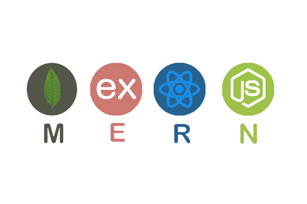

# MERN Stack Monorepo 2025

<p align="center">
  
</p>

<p align="center">
  <strong>Modern Full-Stack Application with TypeScript, Clean Architecture & Real-time Features</strong>
</p>

<p align="center">
  
  
  
  
  
</p>

## 🚀 Overview

A production-ready MERN stack monorepo featuring modern development practices, clean architecture, and comprehensive tooling. Built with TypeScript throughout, this project demonstrates best practices for full-stack development in 2025.

### ✨ Key Features

**🔐 Authentication & Security**
- JWT-based authentication with refresh tokens
- Password recovery and email verification
- Profile management with avatar uploads
- Rate limiting and security middleware

**📝 Todo Management**
- Full CRUD operations with real-time updates
- Advanced filtering and sorting
- Status management (initial, in-progress, completed, cancelled)
- Optimistic UI updates

**💬 Real-time Chat**
- WebSocket-based messaging with Socket.io
- Multiple chat rooms support
- Emoji support and file sharing
- Message history and real-time notifications

**🏗️ Architecture & Development**
- Clean Architecture principles
- Monorepo structure with shared tooling
- Comprehensive testing suite
- Docker containerization
- Cross-platform development scripts

## 🛠️ Technology Stack

**Frontend (Client)**
- **React 19** with TypeScript
- **TanStack Router** for type-safe routing
- **TanStack Query** for server state management
- **Zustand** for client state management
- **Tailwind CSS** + **shadcn/ui** for styling
- **Vite** for fast development and building

**Backend (Server)**
- **Node.js** + **Express** with TypeScript
- **Clean Architecture** with dependency injection
- **Multiple Database Support** (SQLite, PostgreSQL, Supabase, MongoDB)
- **Socket.io** for real-time communication
- **Swagger/OpenAPI** for API documentation
- **Jest** for comprehensive testing

**DevOps & Tooling**
- **Docker** & **Docker Compose** for containerization
- **Cross-platform JavaScript scripts** for development
- **ESLint** + **Prettier** for code quality
- **GitHub Actions** ready CI/CD setup

## 📋 Prerequisites

- **Node.js** >= 18.0.0
- **Package Manager**: Bun (recommended), npm, or yarn
- **Git** for version control
- **Docker** (optional, for containerized development)

## 🚀 Quick Start

### 1. Clone & Setup
```bash
# Clone the repository
git clone <repository-url>
cd example-react

# Install all dependencies
npm run setup
# or with bun
bun run setup
```

### 2. Environment Configuration
```bash
# Create unified environment configuration
cp .env.example .env

# Edit .env with your configuration
# The file contains comprehensive documentation for all variables
```

**Key Environment Variables:**
```bash
# Application
NODE_ENV=development
PORT=3000
IS_SSR=true

# Client Configuration (VITE_ prefix for browser access)
VITE_SERVER_PORT=3000
VITE_CLIENT_PORT=5173
VITE_API_BASE_URL=http://localhost:3000/api
VITE_APP_NAME=React Todo & Chat App 2025

# Authentication (CHANGE IN PRODUCTION!)
JWT_SECRET=your-super-secret-jwt-key-change-this-in-production-2025
JWT_REFRESH_SECRET=your-super-secret-refresh-key-change-this-in-production-2025

# Database
DATABASE_TYPE=sqlite
SQLITE_DATABASE_PATH=./server-ts/data/database.sqlite

# CORS
CORS_ALLOW_ORIGINS=http://localhost:5173,http://localhost:3000
```

### 3. Start Development
```bash
# Start both client and server
npm run dev
# or with bun
bun run dev
```

**Access Points:**
- 🌐 **Client**: http://localhost:5173
- 🔧 **Server**: http://localhost:3000
- 📚 **API Docs**: http://localhost:3000/api-docs
- 🏥 **Health Check**: http://localhost:3000/health

## 📁 Project Structure

```
example-react/
├── 📱 client/                    # React Frontend Application
│   ├── src/
│   │   ├── components/          # Reusable UI components
│   │   │   ├── ui/              # shadcn/ui components
│   │   │   ├── Navigation.tsx   # Main navigation
│   │   │   └── AuthRequired.tsx # Auth guard component
│   │   ├── routes/              # Page components & routing
│   │   │   ├── index.tsx        # Home page
│   │   │   ├── login.tsx        # Authentication pages
│   │   │   ├── todo.tsx         # Todo management
│   │   │   ├── chat.tsx         # Real-time chat
│   │   │   └── profile.tsx      # User profile
│   │   ├── hooks/               # Custom React hooks
│   │   ├── services/            # API service layer
│   │   ├── stores/              # Zustand state stores
│   │   ├── lib/                 # Utility libraries
│   │   └── types/               # TypeScript definitions
│   ├── public/                  # Static assets
│   ├── tests/                   # Frontend tests
│   └── package.json
├── 🔧 server-ts/                # Express Backend (Clean Architecture)
│   ├── src/
│   │   ├── domain/              # Business Logic & Entities
│   │   │   ├── entities/        # Domain entities
│   │   │   ├── repositories/    # Repository interfaces
│   │   │   └── services/        # Domain services
│   │   ├── application/         # Application Business Rules
│   │   │   ├── use-cases/       # Application use cases
│   │   │   ├── dtos/            # Data transfer objects
│   │   │   └── interfaces/      # Application interfaces
│   │   ├── infrastructure/      # External Concerns
│   │   │   ├── database/        # Database implementations
│   │   │   ├── repositories/    # Repository implementations
│   │   │   ├── external-services/ # External services
│   │   │   └── config/          # Configuration
│   │   ├── presentation/        # Controllers & Routes
│   │   │   ├── controllers/     # HTTP controllers
│   │   │   ├── routes/          # Route definitions
│   │   │   ├── middleware/      # Presentation middleware
│   │   │   └── validators/      # Request validators
│   │   └── shared/              # Shared utilities
│   ├── tests/                   # Backend tests
│   │   ├── unit/                # Unit tests
│   │   ├── integration/         # Integration tests
│   │   └── e2e/                 # End-to-end tests
│   ├── data/                    # Database files (SQLite)
│   ├── uploads/                 # File uploads
│   └── package.json
├── 🛠️ scripts/                  # Cross-platform build scripts
│   ├── install.js               # Dependency installation
│   ├── dev.js                   # Development server
│   ├── test.js                  # Test runner
│   ├── build.js                 # Production build
│   ├── deploy.js                # Deployment pipeline
│   ├── clean.js                 # Cleanup utilities
│   └── package-manager.js       # Package manager switching
├── 🐳 Docker files              # Containerization
│   ├── Dockerfile               # Multi-stage Docker build
│   ├── docker-compose.dev.yml   # Development environment
│   ├── docker-compose.prod.yml  # Production environment
│   └── docker-compose.test.yml  # Testing environment
└── 📄 Configuration files
    ├── package.json             # Root workspace configuration
    ├── nginx.conf               # Nginx configuration
    └── Makefile                 # Make commands
```

## 🚀 Development Workflow

### Essential Commands

```bash
# 🔧 Setup & Installation
npm run setup                    # Install all dependencies
npm run pm:switch bun           # Switch to Bun package manager

# 🚀 Development
npm run dev                     # Start both client & server
npm run test                    # Run all tests
npm run test:watch             # Run tests in watch mode

# 🏗️ Production
npm run build                   # Build for production
npm run start                   # Start production server
npm run deploy                  # Full deployment pipeline

# 🧹 Maintenance
npm run clean                   # Clean build artifacts
npm run seed                    # Seed demo data
npm run seed:force             # Force seed with fresh data
```

### Available Scripts

| Script | Command | Description |
|--------|---------|-------------|
| **🔧 Setup** | `npm run setup` | Install dependencies for all packages |
| **🚀 Development** | `npm run dev` | Start development servers concurrently |
| **🧪 Testing** | `npm run test` | Run comprehensive test suite |
| **🏗️ Build** | `npm run build` | Build all packages for production |
| **▶️ Start** | `npm run start` | Start production server |
| **🚀 Deploy** | `npm run deploy` | Complete deployment pipeline |
| **🧹 Clean** | `npm run clean` | Remove build artifacts and caches |
| **📦 Package Manager** | `npm run pm:switch <manager>` | Switch between npm/yarn/bun |
| **🌱 Seed Data** | `npm run seed` | Create demo data for development |

## 📚 API Documentation

### Interactive Documentation
When the server is running, access comprehensive API documentation:

- **📖 Swagger UI**: http://localhost:3000/api-docs
- **🔍 OpenAPI Spec**: http://localhost:3000/api-docs/swagger.json
- **🏥 Health Check**: http://localhost:3000/health
- **ℹ️ API Info**: http://localhost:3000/api

### 🔑 Key API Endpoints

**Authentication & User Management**
```
POST   /api/auth/register     # User registration
POST   /api/auth/login        # User login
POST   /api/auth/logout       # User logout
GET    /api/auth/me           # Get current user profile
PUT    /api/auth/profile      # Update user profile
POST   /api/auth/upload       # Upload profile avatar
```

**Todo Management**
```
GET    /api/todos             # Get todos (with filtering & pagination)
POST   /api/todos             # Create new todo
GET    /api/todos/:id         # Get specific todo
PUT    /api/todos/:id         # Update todo
DELETE /api/todos/:id         # Delete todo
```

**Real-time Chat**
```
GET    /api/chat/rooms        # Get available chat rooms
POST   /api/chat/rooms        # Create new chat room
GET    /api/chat/rooms/:id    # Get room details
WebSocket /socket.io          # Real-time messaging
```

## 🧪 Testing Strategy

### Comprehensive Test Suite
```bash
# Run all tests across the monorepo
npm run test

# Individual package testing
cd client && npm run test        # Frontend tests
cd server-ts && npm run test     # Backend tests

# Watch mode for development
cd client && npm run test:watch
cd server-ts && npm run test:watch

# Coverage reports
cd client && npm run test:coverage
cd server-ts && npm run test:coverage
```

### Test Types
- **Unit Tests**: Individual component/function testing
- **Integration Tests**: API endpoint and database testing
- **E2E Tests**: Full user workflow testing
- **Component Tests**: React component testing with Testing Library

## ⚙️ Unified Environment Configuration

### 🎯 **Single Source of Truth**
All environment variables are now managed from a **single root `.env` file** for simplified deployment and consistency:

```
example-react/
├── .env                    # ✅ Unified configuration (ALL variables)
├── .env.example           # ✅ Template with documentation
├── client/.env.example    # ⚠️ Deprecated (points to root)
└── server-ts/.env.example # ⚠️ Deprecated (points to root)
```

### 🔧 **Variable Categories**

**Client Variables (VITE_ prefix)**
```bash
VITE_SERVER_PORT=3000              # Server port for API calls
VITE_CLIENT_PORT=5173              # Client development port
VITE_API_BASE_URL=http://localhost:3000/api
VITE_WS_URL=http://localhost:3000  # WebSocket URL
VITE_APP_NAME=React Todo & Chat App 2025
VITE_ENABLE_CHAT=true              # Feature flags
```

**Server Variables**
```bash
NODE_ENV=development               # Environment mode
PORT=3000                         # Server port
JWT_SECRET=your-secret            # Authentication secrets
DATABASE_TYPE=sqlite              # Database configuration
CORS_ALLOW_ORIGINS=http://localhost:5173
```

### 🚀 **Migration from Individual .env Files**

If you have existing `.env` files in subdirectories:

```bash
# Analyze existing environment files
npm run env:cleanup

# Migrate to unified configuration (with backup)
npm run env:cleanup:force
```

### 🌍 **Deployment Benefits**

1. **Single Configuration**: One file to manage for all environments
2. **Consistency**: Same variables available to both client and server
3. **Simplified CI/CD**: Single environment configuration in deployment platforms
4. **Version Control**: Easier to track environment changes
5. **Documentation**: Comprehensive inline documentation

### 📋 **Environment Validation**

The system automatically validates environment configuration:

```bash
# Development scripts validate required variables
npm run dev    # Validates and shows environment summary

# Manual validation
node scripts/env-loader.js
```

## 🐳 Deployment Options

### 1. Docker Deployment (Recommended)

**Development Environment**
```bash
# Start development environment with hot reload
docker-compose -f docker-compose.dev.yml up --build
```

**Production Environment**
```bash
# Build and deploy production environment
docker-compose -f docker-compose.prod.yml up --build -d

# View logs
docker-compose -f docker-compose.prod.yml logs -f
```

**Testing Environment**
```bash
# Run tests in containerized environment
docker-compose -f docker-compose.test.yml up --build
```

### 2. Manual Deployment
```bash
# Build for production
npm run build

# Start production server
npm run start

# Or use PM2 for process management
pm2 start ecosystem.config.js
```

### 3. Cloud Deployment

**Frontend (Vercel/Netlify)**
- Build command: `npm run build`
- Output directory: `client/dist`
- Environment variables: Copy all `VITE_*` variables from root `.env`

**Backend (Railway/Render/Heroku)**
- Build command: `npm run build`
- Start command: `npm run start`
- Environment variables: Copy all non-`VITE_*` variables from root `.env`

**Full-Stack (Single Platform)**
- Build command: `npm run build`
- Start command: `npm run start`
- Environment variables: Copy entire root `.env` configuration

### 🔧 **Platform-Specific Environment Setup**

**Vercel**
```bash
# Set environment variables in Vercel dashboard or via CLI
vercel env add VITE_API_BASE_URL production
vercel env add NODE_ENV production
vercel env add JWT_SECRET production
# ... copy all variables from .env
```

**Netlify**
```bash
# Set in Netlify dashboard or netlify.toml
[build.environment]
  VITE_API_BASE_URL = "https://your-api.netlify.app/api"
  NODE_ENV = "production"
```

**Heroku**
```bash
# Set via Heroku CLI
heroku config:set NODE_ENV=production
heroku config:set JWT_SECRET=your-production-secret
heroku config:set DATABASE_TYPE=postgres
# ... copy all variables from .env
```

**Railway**
```bash
# Set in Railway dashboard or railway.json
{
  "deploy": {
    "startCommand": "npm run start",
    "healthcheckPath": "/health"
  }
}
```

## 🎓 Learning Resources

This project serves as a comprehensive learning resource for modern full-stack development:

### 📚 Frontend Concepts
- **React 19**: Latest features including concurrent rendering and server components
- **TypeScript**: Advanced type safety and modern JavaScript features
- **TanStack Router**: Type-safe routing with search params and loaders
- **TanStack Query**: Server state management with caching and synchronization
- **Zustand**: Lightweight state management for client-side state
- **Tailwind CSS**: Utility-first CSS framework for rapid UI development
- **shadcn/ui**: Modern, accessible component library

### 🔧 Backend Architecture
- **Clean Architecture**: Separation of concerns and dependency inversion
- **Domain-Driven Design**: Business logic organization and modeling
- **Repository Pattern**: Data access abstraction
- **Use Cases**: Application business rules implementation
- **Dependency Injection**: Loose coupling and testability

### 🛠️ Development Practices
- **Monorepo Management**: Shared tooling and cross-package dependencies
- **Testing Strategies**: Unit, integration, and E2E testing approaches
- **Docker Containerization**: Development and production environments
- **CI/CD Pipelines**: Automated testing and deployment workflows

## 🤝 Contributing

We welcome contributions! Please follow these guidelines:

### Getting Started
1. **Fork** the repository
2. **Clone** your fork: `git clone <your-fork-url>`
3. **Install** dependencies: `npm run setup`
4. **Create** a feature branch: `git checkout -b feature/amazing-feature`

### Development Process
1. **Make** your changes following the existing code style
2. **Add** tests for new functionality
3. **Run** tests: `npm run test`
4. **Build** the project: `npm run build`
5. **Commit** with conventional commits: `git commit -m 'feat: add amazing feature'`

### Submission
1. **Push** to your branch: `git push origin feature/amazing-feature`
2. **Open** a Pull Request with a clear description
3. **Ensure** all CI checks pass
4. **Respond** to review feedback

### Code Style
- Follow TypeScript strict mode
- Use ESLint and Prettier configurations
- Write meaningful commit messages
- Add JSDoc comments for public APIs
- Maintain test coverage above 80%

## 📄 License

This project is licensed under the **MIT License** - see the [LICENSE](LICENSE) file for details.

### What this means:
- ✅ **Commercial use** - Use in commercial projects
- ✅ **Modification** - Modify and adapt the code
- ✅ **Distribution** - Share and distribute
- ✅ **Private use** - Use in private projects
- ❗ **Liability** - No warranty or liability
- ❗ **Attribution** - Include original license

## 🌟 Support & Community

### Getting Help
- 📖 **Documentation**: Check the README files in each package
- 🐛 **Issues**: [Open an issue](https://github.com/truongnat/example-react/issues) for bugs
- 💡 **Discussions**: [Start a discussion](https://github.com/truongnat/example-react/discussions) for questions
- 📧 **Email**: Contact the maintainers directly

### Show Your Support
If you find this project helpful:
- ⭐ **Star** the repository on GitHub
- 🍴 **Fork** it for your own projects
- 📢 **Share** it with the community
- 🤝 **Contribute** improvements and features

### Stay Connected
- 👨‍💻 **Author**: [truongdq.dev](https://github.com/truongnat)
- 🌐 **Portfolio**: [portfolio-peanut.netlify.app](https://portfolio-truongdq.vercel.app/)
- 📱 **Telegram**: [@peanut201](https://t.me/truongnat)

---

<p align="center">
  <strong>Built with ❤️ for the developer community in 2025</strong>
</p>

<p align="center">
  <a href="#-overview">Back to Top</a>
</p>
